# Course Coach — Backend Implementation Class Diagram

**Version:** 2.0 (as-is after layered refactor)  
**Scope:** Python classes that exist in `backend/`  
**Rule:** names and public operations below must be traceable to source code

FastAPI endpoints are module-level functions, so they are deliberately not
drawn as classes. They form the HTTP boundary and invoke the service classes
shown below.

```mermaid
classDiagram
direction TB

class LoginMock {
  <<schema>>
  +int user_id
}

class ReviewCreate {
  <<schema>>
  +int course_id
  +str content
  +int academic_year
  +str semester
  +str section
  +int rating_satisfaction
  +int rating_difficulty
  +int rating_workload
  +int rating_content
  +int rating_teaching
  +int rating_exam
}

class ReviewUpdate {
  <<schema>>
  +str content
  +int academic_year
  +str semester
  +str section
  +int rating_satisfaction
  +int rating_difficulty
  +int rating_workload
  +int rating_content
  +int rating_teaching
  +int rating_exam
}

class CommentCreate {
  <<schema>>
  +str content
}

class AdminAction {
  <<schema>>
  +Literal~KEEP_DELETE~ action
}

class UserService {
  <<service>>
  +list_users()
  +login_mock(user_id, ip_address)
  +profile(user_id)
  +enrollments(requested_user_id, caller)
}

class CourseService {
  <<service>>
  +list_departments()
  +list_tags()
  +search(search, department)
  +detail(course_id)
  +reviews(course_id, caller_id)
  +my_enrollments(course_id, user_id)
  +rankings()
}

class ReviewService {
  <<service>>
  +create_review(user, data, ip_address)
  +update_review(review_id, user, data, ip_address)
  +delete_review(review_id, user, ip_address)
  +like_review(review_id, user)
  +unlike_review(review_id, user)
  +list_comments(review_id)
  +add_comment(review_id, user, content)
  +report_review(review_id, user, ip_address)
}

class FileService {
  <<service>>
  +upload(review_id, user, upload, ip_address)
  +list_files(review_id)
  +get_download(file_id)
}

class ModerationService {
  <<service>>
  +list_hidden_reviews()
  +apply_action(review_id, action, admin, ip_address)
  +list_audit_logs(limit)
}

class UserRepository {
  <<repository>>
  +list_all(conn)
  +find_by_id(conn, user_id)
  +get_profile(conn, user_id)
  +list_enrollments(conn, user_id)
}

class CourseRepository {
  <<repository>>
  +list_departments(conn)
  +list_tags(conn)
  +search(conn, search, department)
  +get_detail(conn, course_id)
  +list_reviews(conn, course_id, caller_id)
  +list_my_enrollments(conn, user_id, course_id)
  +rankings(conn)
}

class ReviewRepository {
  <<repository>>
  +find_by_id(conn, review_id)
  +course_exists(conn, course_id)
  +find_by_id_for_update(conn, review_id)
  +create(conn, reviewer_id, data)
  +update(conn, review_id, data)
  +soft_delete(conn, review_id)
  +add_like(conn, review_id, user_id)
  +remove_like(conn, review_id, user_id)
  +count_likes(conn, review_id)
  +list_comments(conn, review_id)
  +add_comment(conn, review_id, user_id, content)
  +add_report(conn, review_id, reporter_id)
  +increment_report_count(conn, review_id, threshold)
}

class EnrollmentRepository {
  <<repository>>
  +exists(conn, student_id, course_id, year, semester, section)
}

class AuditLogRepository {
  <<repository>>
  +create(conn, user_id, action, target_id, ip_address)
  +list_recent(conn, limit)
}

class FileRepository {
  <<repository>>
  +create(conn, review_id, uploader_id, filename, path, size)
  +list_by_review(conn, review_id)
  +find_download(conn, file_id)
}

class ModerationRepository {
  <<repository>>
  +list_hidden(conn)
  +lock_review(conn, review_id)
  +apply_action(conn, review_id, action)
}

class ServiceError {
  <<domain error>>
  +int status_code
  +str detail
}

UserService ..> LoginMock : receives data from
ReviewService ..> ReviewCreate : receives
ReviewService ..> ReviewUpdate : receives
ReviewService ..> CommentCreate : receives content from
ModerationService ..> AdminAction : receives action from

UserService o-- UserRepository
UserService o-- AuditLogRepository
CourseService o-- CourseRepository
ReviewService o-- ReviewRepository
ReviewService o-- EnrollmentRepository
ReviewService o-- AuditLogRepository
FileService o-- ReviewRepository
FileService o-- FileRepository
FileService o-- AuditLogRepository
ModerationService o-- ModerationRepository
ModerationService o-- AuditLogRepository

UserService ..> ServiceError : raises
CourseService ..> ServiceError : raises
ReviewService ..> ServiceError : raises
FileService ..> ServiceError : raises
ModerationService ..> ServiceError : raises
```

## Reading the diagram

- `<<schema>>` validates JSON received by FastAPI.
- `<<service>>` owns business rules and transaction boundaries.
- `<<repository>>` executes SQL using the connection supplied by a service.
- `o--` means a service contains/uses that repository.
- `..>` means a dependency, such as accepting a schema or raising an error.

## Traceability to source

| Layer | Source |
|---|---|
| Schemas | `backend/schemas/*.py` |
| Services | `backend/services/*.py` |
| Repositories | `backend/repositories/*.py` |
| Domain error | `backend/domain/errors.py` |
| HTTP boundary functions | `backend/api/*_routes.py` |

The HTTP boundary is represented in Sequence Diagrams, where messages such as
`POST /api/reviews` lead to the real operation
`ReviewService.create_review()` shown here.
