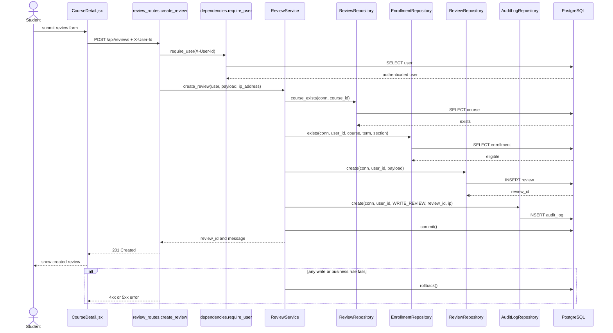

# Create Review — Implementation Sequence Diagram

All participant and operation names correspond to the current implementation.
`create_review` in the API lane is a FastAPI route function; the remaining
named operations are real class methods.

## Identity rule

The author ID is taken only from `require_user`; `ReviewCreate` deliberately
does not contain `reviewer_id`. A client therefore cannot create a review in
another user's name by changing the JSON body.
