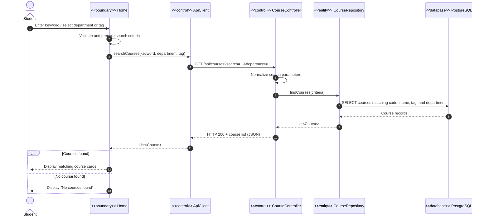
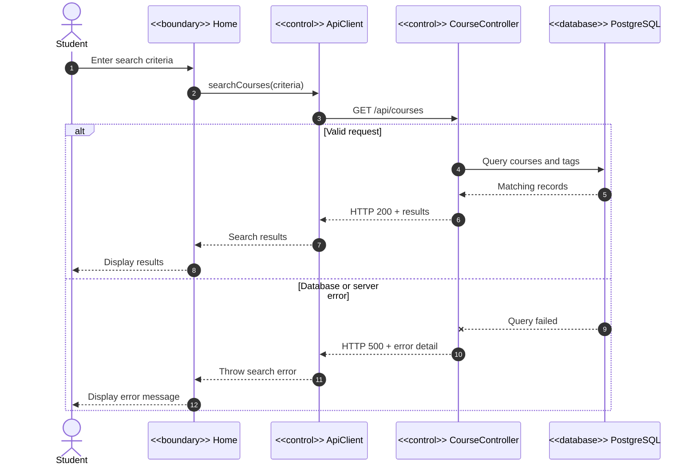

# Course Coach — Sequence Diagram: Search Courses

## Main flow

## Alternative and error flows

## Participant responsibilities

- `Student` — actor who enters a keyword or selects a filter.
- `Home` — boundary class that receives input and displays results.
- `ApiClient` — control class responsible for frontend API communication.
- `CourseController` — control class representing the FastAPI course-search endpoint.
- `CourseRepository` — entity/data-access abstraction for retrieving courses.
- `CourseDatabase` — PostgreSQL database containing courses, tags, and their relationships.

> `CourseRepository` and `CourseController` are conceptual UML classes used to show responsibilities clearly. In the current implementation, their logic is contained in the `list_courses()` endpoint in `backend/main.py`.
